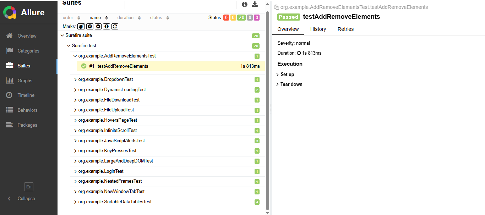
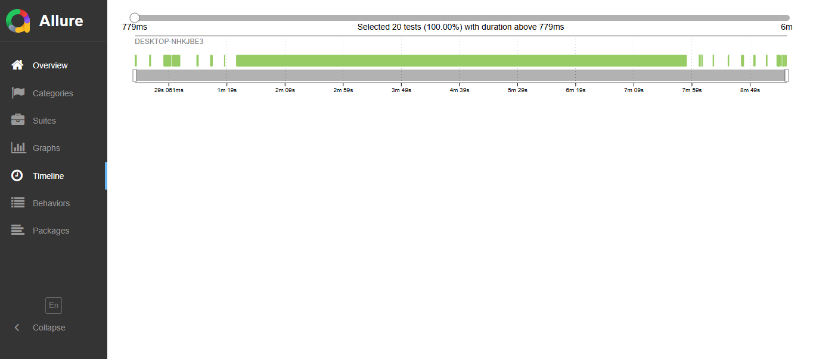
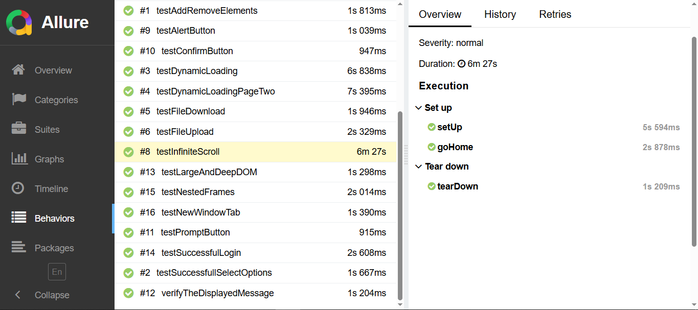

# 🚀 HerokuApp Automation Framework

A professional Web Automation Testing Framework built using **Selenium WebDriver** and **Java**, implementing the **Page Object Model (POM)** design pattern for high maintainability and scalability.

## 🛠️ Tech Stack & Tools
* **Language:** Java (JDK 17)
* **Automation Tool:** Selenium WebDriver (v4.25.0)
* **Testing Framework:** TestNG
* **Reporting:** Allure Reports
* **Build Tool:** Maven
* **Design Pattern:** Page Object Model (POM)
* **Logging & Listeners:** Custom TestNG Listeners for failure screenshots.

## 🏗️ Project Architecture
The project is structured to ensure clean separation of concerns:
- `src/main/java`: Contains Page Objects and Base Pages.
- `src/test/java`: Contains Test Suites and Test Data.
- `src/test/resources`: Configuration files (testng.xml).

## ✨ Key Features
- **Page Object Model:** Enhanced code reusability and reduced maintenance.
- **Automated Reporting:** Detailed Allure reports with step-by-step execution.
- **Failure Analysis:** Automated screenshots on test failure using **TestNG Listeners**.
- **Wait Strategy:** Implemented Explicit Waits to handle dynamic elements and ensure stability.
- **Suite Management:** Optimized `testng.xml` for executing multiple test categories.

## 🧪 Scenarios Covered (20 Tests)
I have automated 20 different test scenarios covering various web elements:
- Login Functionality (Positive/Negative).
- File Upload / Download.
- JavaScript Alerts & Modals.
- Dynamic Loading elements.
- Data Tables & Sorting.
- Checkboxes, Dropdowns, and Hovers.

## 🚀 How to Run the Project
1. Clone the repository.
2. Open the terminal and run all tests:
```bash
mvn clean test
```
   ## 📊 Allure Report Insights

Below are the execution details from the Allure Report, showing a 100% pass rate for the 20 automated test cases:

### 1. Dashboard Overview


### 2. Test Suites & Categories


### 3. Graphs & Timeline


### 4. Detailed Test Case Steps


### 5. Execution Retries & Trends
