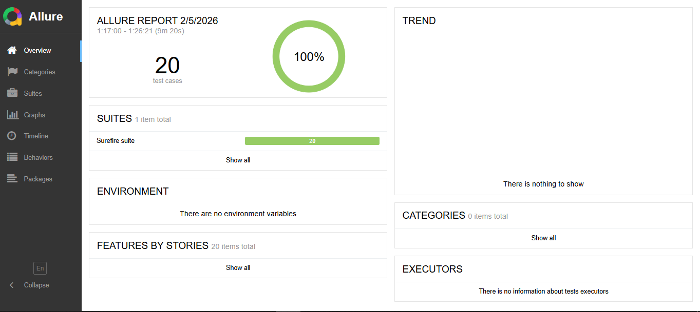
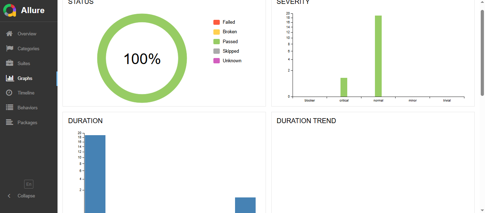

# 🚀 HerokuApp Automation Framework

A professional Web Automation Testing Framework built using **Selenium WebDriver** and **Java**, implementing the **Page Object Model (POM)** design pattern for high maintainability and scalability.

## 🛠️ Tech Stack & Tools
* **Language:** Java (JDK 17)
* **Automation Tool:** Selenium WebDriver (v4.25.0)
* **Testing Framework:** TestNG
* **Reporting:** Allure Reports
* **Build Tool:** Maven
* **Design Pattern:** Page Object Model (POM)
* **Logging & Listeners:** Custom TestNG Listeners for failure screenshots.

## 🏗️ Project Architecture
The project is structured to ensure clean separation of concerns:
- `src/main/java`: Contains Page Objects and Base Pages.
- `src/test/java`: Contains Test Suites and Test Data.
- `src/test/resources`: Configuration files (testng.xml).

## ✨ Key Features
- **Page Object Model:** Enhanced code reusability and reduced maintenance.
- **Automated Reporting:** Detailed Allure reports with step-by-step execution.
- **Failure Analysis:** Automated screenshots on test failure using **TestNG Listeners**.
- **Wait Strategy:** Implemented Explicit Waits to handle dynamic elements and ensure stability.
- **Suite Management:** Optimized `testng.xml` for executing multiple test categories.

## 🧪 Scenarios Covered (20 Tests across 18 Page Objects)
I have engineered a robust automation suite covering **18 distinct page modules** from "The Internet" app, using the **Page Object Model (POM)** for maximum maintainability:

### 🛠️ Core Functional Pages:
* **LoginPage & SecureArea:** Automated secure login/logout flows and session validation.
* **AddRemoveElements:** Validation of dynamic element creation and deletion.
* **Checkboxes & DropdownPage:** Precise automation for standard UI form controls.
* **KeyPressPage:** Simulating real keyboard interactions and input shortcuts.

### 🧩 Advanced UI & Dynamic Elements:
* **DynamicLoading (PageOne & PageTwo):** Handling elements that appear via AJAX or after a delay using **Explicit Waits**.
* **HoversPage:** Testing mouse-over actions on hidden UI components.
* **JavaScriptAlertsPage:** Automating JS Alert, Confirm, and Prompt pop-ups.
* **InfiniteScroll & LargeAndDeepDOM:** Handling complex page structures and scrolling behaviors.

### 🔍 Window & Frame Management:
* **FramePage & NestedFrames:** Switching between complex iFrame structures.
* **MultipleWindows & NewWindowTabPage:** Controlling and validating multi-tab browser sessions.
* **FileUpload & FileDownloadPage:** End-to-end automation for file handling scenarios.
* **SortableDataTables:** Extracting and validating dynamic data from sortable tables.

## 🚀 How to Run the Project
1. Clone the repository.
2. Open the terminal and run all tests:
```bash
mvn clean test
```
   ## 📊 Allure Report Insights

Below are the execution details from the Allure Report, showing a 100% pass rate for the 20 automated test cases:

### 1. Dashboard Overview


### 2. Test Suites & Categories


### 3. Graphs & Timeline


### 4. Detailed Test Case Steps


### 5. Execution Retries & Trends
